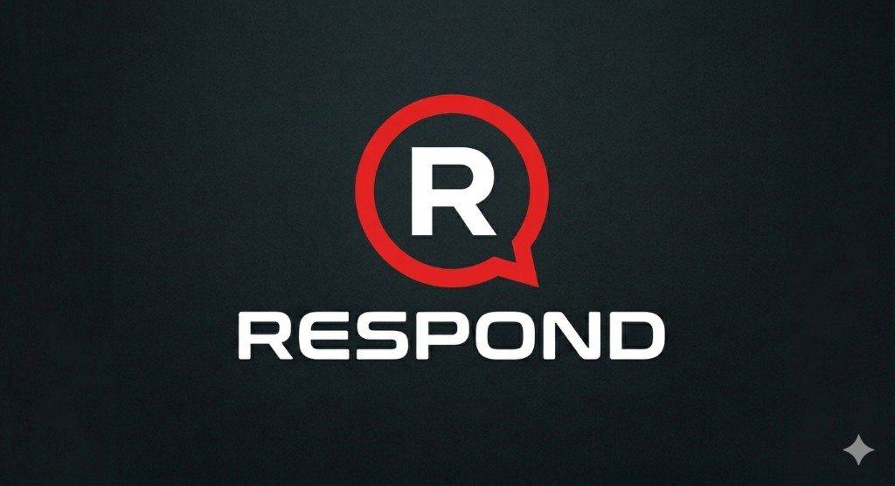

<p align="center">
  
</p>

# Respond+

**Respond — lynrask teamkommunikasjon med tale, chat og filer på noden.**

Real-time communication and collaboration platform targeting a native **Go + Wails** desktop app (Windows `.exe`) and later Android (`.apk`). Focus: ultra-low latency voice, secure tunneling, and proprietary **NoNoise** voice isolation.

**Repo:** [github.com/qeamer/Respond](https://github.com/qeamer/Respond)
## Stack (this tree)

| Layer | Technology |
|-------|------------|
| Backend | Go HTTP + WebSocket on `:8080`, SQLite (`modernc.org/sqlite`) |
| Voice | Central **SFU** via [Pion WebRTC v4](https://github.com/pion/webrtc) — **Opus only**, no browser mesh P2P |
| UI | `frontend/src/index.html` (`//go:embed`) — Wails WebView + browser node |
| Future | NoNoise C++ SDK via CGO in RTP fan-out path; Whisper.cpp STT |

## Requirements

- Go 1.24+ ([go.dev/dl](https://go.dev/dl/))
- No CGo required for SQLite (pure Go driver)

## Build and run

### Desktop app (Wails v2 — shipping target)

Requires [Go](https://go.dev/dl/), [Wails CLI](https://wails.io/docs/gettingstarted/installation), and WebView2 on Windows.

```powershell
cd respond-v2
go mod tidy
wails dev
wails build   # Respond.exe in build/bin/
```

The WebView loads `frontend/src/index.html`. The Go node (SQLite + SFU hub) starts on `:8080` in the background; the UI connects to `ws://127.0.0.1:8080/ws` as before.

If you see `open build\windows\icon.ico: The system cannot find the path specified`:

1. Pull latest `wails.json` (must **not** contain `"projectdir": "."`).
2. Ensure `build/windows/icon.ico` exists, or run `.\scripts\install-wails-build.ps1`.

### Headless node (browser prototype)

```powershell
go build -ldflags="-s -w" -o respond-node.exe ./cmd/respond-node
.\respond-node.exe
```

Open [http://localhost:8080](http://localhost:8080). Or use `start.bat` (builds `respond-node.exe` and opens the browser). See **[ROADMAP.md](ROADMAP.md)**.

Dev auth token format (first WS message): `dev:<userId>:<displayName>`.

## Voice architecture (SFU)

```
Client (1× RTCPeerConnection) ──WebRTC──► Go SFU (1× PC per user)
                                              │
                    Opus RTP fan-out ◄──────────┘ per channel/lobby
```

- Clients send `webrtc_offer` / `webrtc_answer` / `webrtc_ice` **only to the server** (no `to` peer field).
- Server forwards each publisher's Opus RTP to every other member in the same channel.
- Hook point for **NoNoise**: `internal/ws/sfu.go` — `fanoutLoop` before `WriteRTP`.
- Changing channel tears down voice (`webrtc_hangup` / server `RemovePeer`) and re-joins after `join_channel`.

## Project layout

```
main.go, app.go    Wails desktop entry (must live at repo root)
cmd/respond-node/  Headless HTTP+WS server
frontend/src/      index.html (UI for Wails + node)
frontend/embed.go  //go:embed for Wails AssetServer
internal/node/     HTTP mux, DB, hub startup
internal/db/       SQLite persistence
internal/ws/       WebSocket hub + SFU (ws.go, sfu.go)
```

## Handoff for Cursor / contributors

See **[HANDOFF.md](HANDOFF.md)** for architecture and **[AI_HANDOFF.md](AI_HANDOFF.md)** for full changelog and file map (for Gemini/Claude/Cursor).

## Related repositories

- **NoNoise SDK:** [github.com/Nigvar/No-noise](https://github.com/Nigvar/No-noise) — STFT / ring-buffer pipeline; ML trained on proprietary custom-recorded datasets; integrate at SFU RTP buffer.

## License

MIT — see [LICENSE](LICENSE).
